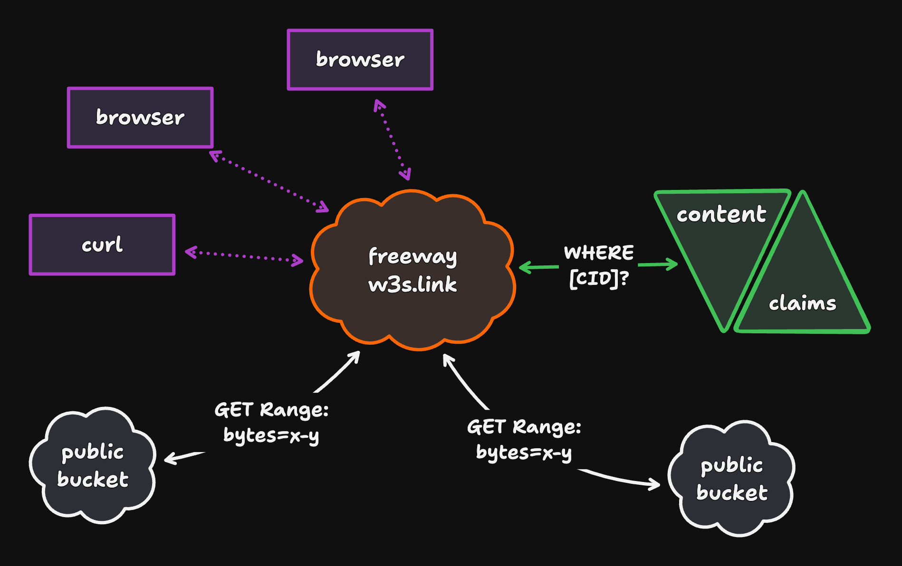

# freeway

<p>
  <a href="https://github.com/web3-storage/freeway/actions/workflows/release.yml"></a>
  <a href="https://discord.com/channels/806902334369824788/864892166470893588"></a>
  <a href="https://github.com/web3-storage/freeway/blob/main/LICENSE.md"></a>
</p>

🧪 Experimental IPFS HTTP gateway providing access to UnixFS data via CAR CIDs.



## Running Locally

1. Install the project
```sh
npm install
```

2. CloudFlare Authentication
```sh
npx wrangler login
```

3. Get Your Account Id
```sh
npx wrangler whoami
```

4. Add your configs to `wrangler.toml`
```sh
[env.YOUR_USERNAME]
# Custom name for your testing/dev worker
name = "YOUR_USERNAME-freeway"
workers_dev = true
# Account Id from step 3
account_id = "YOUR_ACCOUNT_ID"
# See step 4.2 to create the R2 Bucket
r2_buckets = [
  { 
    binding = "CARPARK", bucket_name = "carpark-YOUR_USERNAME-0", preview_bucket_name = "carpark-YOUR_USERNAME-preview-0" 
  }
]

[env.YOUR_USERNAME.vars]
DEBUG = "true"
FF_RATE_LIMITER_ENABLED = "false"
CONTENT_CLAIMS_SERVICE_URL = "https://dev.claims.web3.storage"
```

If you want to enable the Rate Limiter and KV add the following too:
```sh
[[env.YOUR_USERNAME.unsafe.bindings]]
name = "RATE_LIMITER"
type = "ratelimit"
namespace_id = "0"
simple = { limit = 100, period = 60 }

[[env.YOUR_USERNAME.kv_namespaces]]
binding = "AUTH_TOKEN_METADATA"
# See step 4.1 to create the KV store
id = "KV_ID"
```

4.1
In order to get the KV ID you need to create a KV with the following command:
```sh
 npx wrangler kv namespace create YOUR_USERNAME-AUTH_TOKEN_METADATA       
 ```
Copy the `id` from the output and add it to your `env.YOUR_USERNAME.kv_namespaces`.

4.2
You will also need to create the R2 Bucket:
```sh
npx wrangler r2 bucket create carpark-YOUR_USERNAME-0
```

5. Start local server
```sh
npx wrangler dev -e YOUR_USERNAME
```

## Testing

Freeway is using miniflare v3 for testing which allows you to define the testing configurations in the JavaScript code (see `src/test/index.spec.js`). 

Note:
- Miniflare v3 doesn't support the Rate Limiting binding for now, so we need to mock the rate limiting API to be able to use it in tests and in local development.

In order to run the existing tests you can execute the following commands:

**Miniflare Tests**
```sh
npm run test:miniflare
```

**Unit Tests**
```sh
npm run test:unit
```

**Integration Tests**
```sh
npm run test:integration
```

## Deployment

Deploy the worker to Cloudflare using your environment configuration:
```sh
npx wrangler deploy -e YOUR_USERNAME
```

In order to remove the worker after your testing is done, you can execute:
```sh
npx wrangler delete YOUR_WORKER_NAME -e YOUR_USERNAME
```
If you are connected with the Cloudflare Company account, please make sure you are not deleting the `freeway-worker` - which is the Production worker.

## Contributing

Feel free to join in. All welcome. Please read our [contributing guidelines](https://github.com/web3-storage/freeway/blob/main/CONTRIBUTING.md) and/or [open an issue](https://github.com/web3-storage/freeway/issues)!

## License

Dual-licensed under [MIT + Apache 2.0](https://github.com/web3-storage/freeway/blob/main/LICENSE.md)
