# Freeway

```mermaid
sequenceDiagram
actor Alice
participant Freeway as 🛣<br/><br/>Freeway #32;
participant DUDEWHERE as 🚗🪣<br/><br/>DUDEWHERE
participant SATNAV as 🛰🪣 <br/><br/>SATNAV
participant CARPARK as 🅿️🪣 <br/><br/>CARPARK

Alice -->> Freeway: GET freeway.dag.haus/ipfs/bafyROOT...
Freeway -->> DUDEWHERE: Where is bafyROOT?
DUDEWHERE -->> Freeway: In bagyCAR1, bagyCAR2
Freeway -->> SATNAV: Read bagyCAR1.idx
SATNAV -->> Freeway: bagyCAR1 index data
Freeway -->> SATNAV: Read bagyCAR2.idx
SATNAV -->> Freeway: bagyCAR2 index data
note over Freeway:Can start reading blocks

Freeway -->> CARPARK: Read bafyROOT
CARPARK -->> Freeway: bafyROOT bytes
note over Freeway:Decode root block<br/>no data, just links...

Freeway -->> CARPARK: Read bafkBLOCK1
CARPARK -->> Freeway: bafkBLOCK1 bytes
Freeway -->> Alice: UnixFS file bytes

Freeway -->> CARPARK: Read bafkBLOCK2
CARPARK -->> Freeway: bafkBLOCK2 bytes
Freeway -->> Alice: UnixFS file bytes

Freeway -->> CARPARK: Read bafkBLOCK3
CARPARK -->> Freeway: bafyBLOCK3 bytes
Freeway -->> Alice: UnixFS file bytes
```



Nuances:

* Indexes are read in parallel.
* Freeway doesn't finish reading all index data before it starts to fetch blocks. If while reading indexes it encounters a wanted block CID then it provides the index information immediately.
* Block reads from CARPARK are batched so that multiple blocks are read in a single request.

Observations:

* TTFB depends on how much index data needs to be read before the root CID is encountered.
* Effective block read batching, as we know all wanted block positions upfront.

## Blockly (BLOCK LYnk) indexes

Blockly is a collection of [multi-indexes](https://github.com/web3-storage/specs/blob/73c386b999cf30fb648987ff9dce0516c1d91137/CARv2%20MultiIndex.md) for individual blocks. Each index contains the CID of a CAR file the block may be found in and the block's byte offset. The index also contains the _same detail for any links_ the block has.

Examples:

```
R
L0 L1 L2
```

Since this DAG is very shallow, all of the indexing information can be found in the blockly index for `R`.

1. Index request for `R`
1. Block requests for `R` `L0` `L1` `L2` (possibly batched)

```
R
L0       L1
L2 L3    L4 L5
```

This DAG requires 3 requests to blockly indexes (`R`, `L0` and `L1`) to retrieve all the needed indexing information.

1. Index request for `R`
1. Block requests for `R` `L0` `L1` (possibly batched)
1. Index requests for `L0` `L1`
1. Block requests for `L2` `L3` `L4` `L5` (possibly batched)

Note: there is scope for concurrency above, for example we can retrieve blocks for `R`, `L0` and `L1` at the same time as we request indexes for `L0`, `L1`.

Trade offs:

* There is some repeated information - the CID and offset for a given block can be found in it's own index but also in the indexes of any blocks that link to it.
* IPLD codecs must be known in order to build the indexes for a DAG.

Advantages:

* There are considerably fewer index read requests to make to serve a given DAG when each block index includes link data also.
* Grouping indexing data by locality in this way facilitates batching range requests to CAR files to fetch multiple blocks in a single request.
* If a DAG is built using the default web3.storage (and Filecoin) settings (1MiB chunks, 1,024 max children) we're able to service up to ~1GiB of data by reading just 1 blockly index (which would be roughly 37KiB).
