# Freeway

```mermaid
sequenceDiagram
actor Alice
participant Freeway as 🛣<br/><br/>Freeway #32;
participant DUDEWHERE as 🚗🪣<br/><br/>DUDEWHERE
participant SATNAV as 🛰🪣 <br/><br/>SATNAV
participant CARPARK as 🅿️🪣 <br/><br/>CARPARK

Alice -->> Freeway: GET freeway.dag.haus/ipfs/bafyROOT...
Freeway -->> DUDEWHERE: Where is bafyROOT?
DUDEWHERE -->> Freeway: In bagyCAR1, bagyCAR2
Freeway -->> SATNAV: Read bagyCAR1.idx
SATNAV -->> Freeway: bagyCAR1 index data
Freeway -->> SATNAV: Read bagyCAR2.idx
SATNAV -->> Freeway: bagyCAR2 index data
note over Freeway:Can start reading blocks

Freeway -->> CARPARK: Read bafyROOT
CARPARK -->> Freeway: bafyROOT bytes
note over Freeway:Decode root block<br/>no data, just links...

Freeway -->> CARPARK: Read bafkBLOCK1
CARPARK -->> Freeway: bafkBLOCK1 bytes
Freeway -->> Alice: UnixFS file bytes

Freeway -->> CARPARK: Read bafkBLOCK2
CARPARK -->> Freeway: bafkBLOCK2 bytes
Freeway -->> Alice: UnixFS file bytes

Freeway -->> CARPARK: Read bafkBLOCK3
CARPARK -->> Freeway: bafyBLOCK3 bytes
Freeway -->> Alice: UnixFS file bytes
```

Nuances:

* Indexes are read in parallel.
* Freeway doesn't finish reading all index data before it starts to fetch blocks. If while reading indexes it encounters a wanted block CID then it provides the index information immediately.
* Block reads from CARPARK are batched so that multiple blocks are read in a single request.

Observations:

* TTFB depends on how much index data needs to be read before the root CID is encountered.
* Effective block read batching, as we know all wanted block positions upfront.
