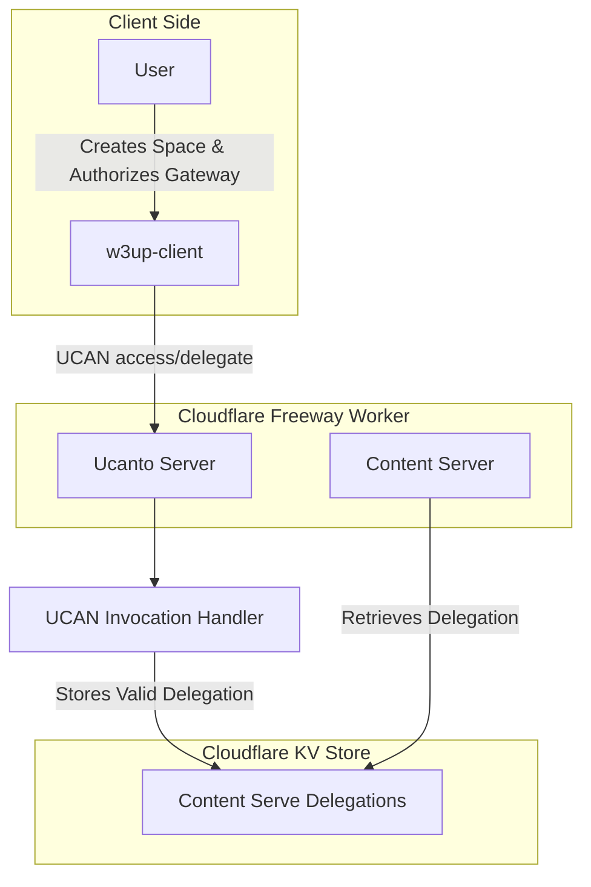

### Gateway Content Serve Authorization Flow

### Explanation
1. **User Interaction**
    - The user interacts with the `w3up-client` to create a space and authorize the gateway to serve content.

2. **UCAN Invocation**
    - The `w3up-client` sends a UCAN invocation `access/delegate` to the Ucanto Server, providing the delegation details (`{ space, proofs }`).
    - The request is processed by the UCAN Invocation Handler in the Cloudflare Freeway Worker.

3. **Validation Steps**
   - It validates that the delegation matches the expected capability (`space/content/serve/*`).
   - It ensures the proof chain is valid.

4. **Storing Delegation**
    - After successful validation, the delegation is stored in the KV Store (`Content Serve Delegations Storage`) for further use.

5. **Content Server Retrieval**
    - The Freeway Worker retrieves the validated delegations from the KV Store to serve content for authorized spaces.

### Key Considerations
- **Mitigating DoS Attacks**
    - By verifying that the space is provisioned before accepting the delegation, we can reduce the risk of abuse from unauthorized or irrelevant requests. 
    - We still need to implement this verification in another iteration.
- **Efficiency**
    - This additional validation ensures only relevant delegations are processed and stored, minimizing resource waste.
- **Implementation**
    - Adding a check against the space provisioning status in the `Ucanto Server` can be done efficiently by querying the space registry or relevant provisioning database.
