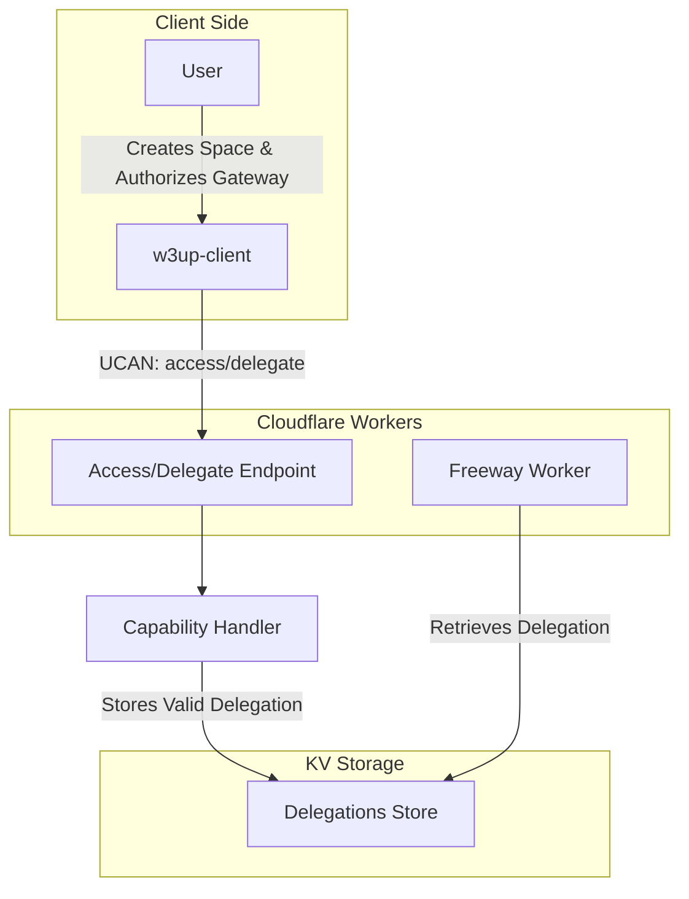

### Gateway Content Serve Authorization Flow

### Explanation
1. **User Interaction**: The user interacts with the `w3up-client` to create a space and authorize the gateway to serve content.

2. **UCAN Invocation**: The `w3up-client` invokes the `access/delegate` UCAN handler, providing the delegation details (`{ space, proofs }`). The request is sent to the Cloudflare `Access/Delegate Endpoint`.

3. **Validation Steps**:
   - The endpoint checks whether the space referenced in the delegation has been provisioned.
   - It validates that the delegation matches the expected capability (`space/content/serve/*`).
   - It ensures the proof chain is valid.

4. **Relevance Check**: Only delegations associated with a provisioned space are accepted to prevent unnecessary resource usage and mitigate the risk of DoS attacks.

5. **Storing Delegation**: After successful validation, the delegation is stored in the KV Store (`Delegations Store`) for further use.

6. **Freeway Worker Retrieval**: The Freeway Worker retrieves the validated delegations from the KV Store to serve content for authorized spaces.

### Key Considerations
- **Mitigating DoS Attacks**: By verifying that the space is provisioned before accepting the delegation, we can reduce the risk of abuse from unauthorized or irrelevant requests.
- **Efficiency**: This additional validation ensures only relevant delegations are processed and stored, minimizing resource waste.
- **Implementation**: Adding a check against the space provisioning status in the `Access/Delegate Endpoint` can be done efficiently by querying the space registry or relevant provisioning database. It will probably tackled in a second iteration.
